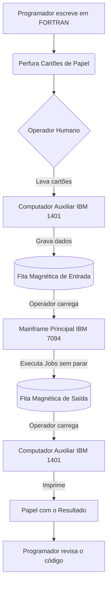
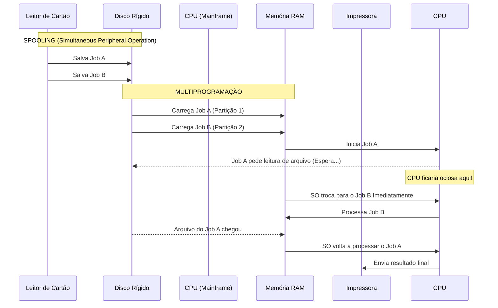

# 📘 APOSTILA DE REVISÃO: SISTEMAS OPERACIONAIS MODERNOS
> ✍️ **Autores Base:** Andrew S. Tanenbaum, Herbert Bos
> 📖 **Trecho Analisado:** Páginas 5 a 13 + Expansão da 4ª Geração
> 🎓 **Foco:** Preparação para provas de Análise e Desenvolvimento de Sistemas (ADS) - 3º Semestre

---

## 📌 ÍNDICE
1. [O Que é um Sistema Operacional?](#1-o-que-e-um-sistema-operacional)
2. [A Visão Top-Down (Máquina Estendida)](#2-a-visao-top-down)
3. [A Visão Bottom-Up (Gerenciador de Recursos)](#3-a-visao-bottom-up)
4. [Evolução Histórica dos Sistemas Operacionais](#4-evolucao-historica)
5. [Tabela Geral de Gerações](#5-tabela-geral-de-geracoes)
6. [Glossário de Termos Técnicos](#6-glossario-de-termos)
7. [Questionário de Preparação para Provas](#7-questionario)

---

## 1️⃣ O QUE É UM SISTEMA OPERACIONAL?

A definição de um Sistema Operacional (SO) varia dependendo do ponto de vista do observador. Para um programador, ele é uma ferramenta de facilitação. Para os engenheiros de hardware, ele é um maestro que evita o caos.

Para organizar essas ideias, o livro adota duas perspectivas fundamentais:
* Visão **Top-Down** (De cima para baixo)
* Visão **Bottom-Up** (De baixo para cima)

Abaixo, detalhamos cada uma dessas visões com quadros comparativos.

---

## 2️⃣ A VISÃO TOP-DOWN: A MÁQUINA ESTENDIDA

O hardware puro é extremamente complexo, desajeitado e difícil de programar. A visão Top-Down enxerga o SO como uma camada de software (que roda em modo núcleo) cuja única função é esconder essa feiura e oferecer uma "Máquina Estendida" ou "Máquina Virtual" bonita e fácil de usar.


### 📊 Tabela Comparativa: Hardware Nu vs. Máquina Estendida

| Característica | Visão do Hardware Nu (Sem SO) | Visão da Máquina Estendida (Com SO) |
| :--- | :--- | :--- |
| **Armazenamento** | Setores, trilhas, cilindros, pulsos magnéticos, motores do disco. | Arquivos, Diretórios, Pastas, Árvores de arquivos. |
| **Comandos** | Sinais elétricos, controle de temporizadores, envio de bits diretos. | `open()`, `read()`, `write()`, `close()`. |
| **Complexidade** | Altíssima. Exige conhecimento mecânico e elétrico da peça. | Baixa. O programador foca apenas na lógica do seu software. |
| **Portabilidade** | Nula. Um código escrito para um disco X não roda no disco Y. | Alta. O comando `read()` funciona em qualquer marca de disco rígido. |

---

## 3️⃣ A VISÃO BOTTOM-UP: O GERENCIADOR DE RECURSOS

Nesta visão, o SO não é um "facilitador", mas sim um "controlador". Em um sistema moderno, temos dezenas de programas concorrentes exigindo CPU, Memória RAM, Disco e Rede ao mesmo tempo. O SO atua como um gerente que aloca esses recursos de forma ordenada e justa.

O mecanismo central que o SO usa para fazer esse gerenciamento chama-se **Multiplexação** (ou compartilhamento).


### 📊 Tabela Comparativa: Tipos de Multiplexação

| Tipo de Multiplexação | O que significa na prática? | Exemplo Clássico de Hardware | Como Funciona? |
| :--- | :--- | :--- | :--- |
| **No Tempo (Time)** | Os programas formam uma fila e se revezam no uso do recurso. | **CPU (Processador)** | O SO dá 50 milissegundos para o Programa A, depois passa para o B, depois para o C, e volta pro A. |
| **No Espaço (Space)** | O recurso é dividido fisicamente. Vários usam ao mesmo tempo. | **Memória RAM** | O SO entrega os primeiros gigabytes para o Sistema, os próximos para o Navegador, isolando-os fisicamente. |
| **No Tempo e Espaço** | O recurso pode usar ambas as técnicas dependendo da arquitetura. | **Disco Rígido (HDD)** | Arquivos dividem o espaço do disco, mas a agulha de leitura atende a uma requisição por vez (tempo). |

---

## 4️⃣ EVOLUÇÃO HISTÓRICA DOS SISTEMAS OPERACIONAIS

A evolução dos SOs é estritamente ligada à evolução dos componentes eletrônicos. Conforme o hardware ficava mais poderoso, o software precisava acompanhar.

### 🔌 A. Primeira Geração (1945 - 1955)
* **Hardware:** Válvulas de Vácuo e Painéis de Conexão.
* **Características:**
  * Máquinas do tamanho de salas inteiras.
  * Consumo colossal de energia.
  * Não existia o conceito de "Software" isolado do "Hardware".
* **Como era programado?**
  * Conectando fios físicos.
  * Sem linguagem de programação.
* **Qual era o Sistema Operacional?**
  * **Nenhum.** O operador humano era o sistema operacional vivo.

### 📻 B. Segunda Geração (1955 - 1965)
* **Hardware:** Transistores e Mainframes.
* **Características:**
  * Computadores tornam-se comerciais, mas ainda trancados em salas de ar condicionado.
  * Programação feita em Cartões Perfurados.
* **O Surgimento dos Sistemas em Lote (Batch):**
  * O problema era a ociosidade da máquina enquanto o humano andava pela sala.
  * A solução foi criar um "Lote" de programas gravados em uma fita.
  * O computador lia essa fita e rodava tudo sem parar.

#### 🔄 Fluxo de um Sistema Batch Clássico:
1. Programador perfura cartões de papel (FORTRAN ou Assembly).
2. Entrega a caixa de cartões ao Operador.
3. Operador coloca os cartões no Computador Auxiliar (ex: IBM 1401).
4. O Computador Auxiliar grava todos os trabalhos em uma Fita Magnética.
5. A Fita Magnética é levada ao Mainframe Principal (ex: IBM 7094).
6. O Mainframe executa os programas da fita e grava o resultado em uma Fita de Saída.
7. A Fita de Saída é levada ao Computador Auxiliar para ser impressa no papel.

### 💾 C. Terceira Geração (1965 - 1980)
* **Hardware:** Circuitos Integrados (CIs) e Família IBM System/360.
* **A Revolução do Software:**
  * Sistemas operacionais gigantes, criados para rodar em várias máquinas diferentes.
  * Introdução de três conceitos vitais que mudaram a computação:

#### 1. Multiprogramação
Em vez de deixar a memória apenas com um programa, o SO divide a RAM em partições. Se o trabalho A parar para ler algo do disco, o SO imediatamente dá a CPU para o trabalho B.

#### 2. Spooling (Simultaneous Peripheral Operation On Line)
Eliminou a dependência do transporte manual de fitas magnéticas. Os cartões eram lidos diretamente para o Disco Rígido, e a impressora puxava os dados diretamente do Disco Rígido.


#### 3. Tempo Compartilhado (Timesharing)
O nascimento da interatividade.
* Vários usuários conectados via terminais burros (teclado + monitor).
* O SO revezava a CPU tão rápido entre eles que parecia que cada um tinha um Mainframe particular.
* O sistema MULTICS tentou aperfeiçoar isso, falhou comercialmente, mas inspirou Ken Thompson a criar o **UNIX**.

### 💻 D. Quarta Geração (1980 - Presente)
* **Hardware:** LSI/VLSI (Integração em Larga Escala) - Os Microprocessadores.
* **Características:**
  * O computador deixa as grandes corporações e vai para a mesa do usuário comum (Personal Computer - PC).
  * O sistema operacional foca na usabilidade.
* **Evolução da Interface:**
  * **Anos 80:** Sistemas de linha de comando baseados em disco, como o MS-DOS (Microsoft Disk Operating System).
  * **Anos 90:** A revolução da GUI (Graphical User Interface). Inspirados pela Xerox, Apple lança o Macintosh e a Microsoft lança o Windows. Mouse, janelas e ícones viram o padrão.

#### Redes e Sistemas Distribuídos
A partir da 4ª geração, os PCs começam a se conectar.

| Característica | Sistema Operacional de Rede | Sistema Operacional Distribuído |
| :--- | :--- | :--- |
| **Consciência do Usuário** | O usuário sabe que há várias máquinas independentes na rede. | O usuário acha que está usando um único supercomputador. |
| **Login** | Usuário faz login em uma máquina específica (ex: PC do RH). | Usuário faz login "no sistema" e não sabe qual máquina o atende. |
| **Arquivos** | O usuário precisa saber que o arquivo está na "Máquina Servidora X". | O arquivo simplesmente aparece, o SO decide em qual máquina salvar fisicamente. |
| **Complexidade** | Média/Alta. | Altíssima. |

---

## 5️⃣ TABELA GERAL: RESUMO DAS GERAÇÕES

| Geração | Período | Hardware Principal | Software / SO Característico | Principal Inovação do Período |
| :---: | :---: | :--- | :--- | :--- |
| **1ª** | 1945-1955 | Válvulas Eletrônicas | Sem Sistema Operacional | Primeiros computadores funcionais |
| **2ª** | 1955-1965 | Transistores | Sistemas em Lote (Batch) | Automação da fila de execução |
| **3ª** | 1965-1980 | Circuitos Integrados | OS/360, UNIX, MULTICS | Multiprogramação e Timesharing |
| **4ª** | 1980-Hoje | Microprocessadores | MS-DOS, Windows, Linux, macOS | PCs, Interface Gráfica (GUI), Redes |

---

## 6️⃣ GLOSSÁRIO DE TERMOS TÉCNICOS FUNDAMENTAIS

* **Kernel (Núcleo):** A parte central e mais privilegiada do Sistema Operacional. Ele tem acesso direto a todo o hardware.
* **Modo Usuário (User Mode):** Modo restrito onde os aplicativos comuns (navegadores, jogos) rodam. Eles não podem acessar o hardware diretamente; precisam pedir permissão ao SO.
* **Modo Núcleo (Kernel Mode):** Modo de operação onde o SO roda. Tem poder total sobre a máquina.
* **Concorrência:** A capacidade do sistema de lidar com vários processos e tarefas "ao mesmo tempo".
* **Ociosidade da CPU:** O pior inimigo dos computadores antigos. É o tempo que o processador fica ligado, mas sem processar nada, apenas esperando algum dado chegar.
* **Interface Gráfica (GUI):** Camada visual (janelas, botões, ícones) criada para que o usuário interaja com a "Máquina Estendida" sem precisar decorar comandos de texto.

---

## 7️⃣ QUESTIONÁRIO DE PREPARAÇÃO PARA PROVAS (Q&A)

**Q1: Por que é correto afirmar que o Sistema Operacional atua como uma "Máquina Estendida"?**
*Resposta:* Porque ele oculta os detalhes complexos, feios e mecânicos do hardware real (fios, trilhas magnéticas, sinais elétricos) e apresenta ao programador uma interface virtual mais elegante, simples e padronizada (como os conceitos de arquivos e pastas).

**Q2: Qual era o principal problema que os Sistemas em Lote (Batch) da segunda geração tentaram resolver?**
*Resposta:* O grande problema era o tempo ocioso da CPU. Como as máquinas eram extremamente caras, elas não podiam ficar paradas esperando um operador humano andar pela sala carregando cartões perfurados. O lote automatizou essa transição.

**Q3: O que é a Multiprogramação e em qual geração de hardware ela surgiu?**
*Resposta:* Surgiu na 3ª Geração (Circuitos Integrados). É a técnica de dividir a memória RAM em partições para abrigar vários programas simultaneamente. Assim, se o Programa A parar para esperar uma leitura de disco, a CPU não fica parada, ela passa a processar o Programa B.

**Q4: Se você precisa dividir a memória RAM entre 3 programas simultaneamente, qual tipo de multiplexação o SO está utilizando?**
*Resposta:* Multiplexação no Espaço, pois o recurso (memória) está sendo fatiado e distribuído fisicamente ao mesmo tempo.

**Q5: Diferencie um SO de Rede de um SO Distribuído.**
*Resposta:* No SO de Rede, as máquinas são autônomas e o usuário tem total consciência de qual máquina ele está acessando pela rede. No SO Distribuído, várias máquinas trabalham em conjunto para formar uma única imagem, e o usuário interage como se tudo fosse um único e poderoso sistema, ignorando a rede física por trás.

# 🖥️ O GRANDE GUIA: SISTEMAS OPERACIONAIS MODERNOS
> 📖 **Baseado em:** Andrew S. Tanenbaum, Herbert Bos (Páginas 5 - 13)
> 🚀 **Foco:** Arquitetura, História e Abstração de Hardware
> 🎓 **Material de Estudo:** 3º Semestre - Análise e Desenvolvimento de Sistemas (ADS)

---


## 🎨 1. ILUSTRAÇÃO: A ABSTRAÇÃO DO SISTEMA OPERACIONAL
Para entender a Visão Top-Down (Máquina Estendida), veja o diagrama em ASCII abaixo, gerado para ilustrar as camadas de proteção entre o usuário e o hardware nu.

```text
=============================================================================
                          [ ESPAÇO DO USUÁRIO ]
=============================================================================
       +-----------------+     +-----------------+     +-----------------+
       |  Navegador Web  |     | Editor de Texto |     |  Jogo (Ex: RPG) |
       +--------+--------+     +--------+--------+     +--------+--------+
                |                       |                       |
                v                       v                       v
       +-----------------------------------------------------------------+
       |                     BIBLIOTECAS PADRÃO (libc)                   |
       +-----------------------------------------------------------------+
                                       | (System Calls - Ex: read, write)
=============================================================================
                          [ ESPAÇO DO NÚCLEO (KERNEL) ]
=============================================================================
                                       v
       +-----------------------------------------------------------------+
       |                     SISTEMA OPERACIONAL                         |
       |                                                                 |
       |  +----------------+  +------------------+  +-----------------+  |
       |  | Gerenc. de Mem |  | Sistema Arquivos |  | Escalonador CPU |  |
       |  +----------------+  +------------------+  +-----------------+  |
       +-----------------------------------------------------------------+
                                       |
                                       v
       +-----------------------------------------------------------------+
       |                       DRIVERS DE DISPOSITIVOS                   |
       +-----------------------------------------------------------------+
=============================================================================
                                 [ HARDWARE NU ]
=============================================================================
       +------+  +-------------------+  +-------------------+  +---------+
       | CPU  |  |    MEMÓRIA RAM    |  | DISCO RÍGIDO (HD) |  | PLACA DE|
       |      |  | [][][][][][][][][]|  |     ( @ )         |  |   REDE  |
       +------+  +-------------------+  +-------------------+  +---------+
```

---

## 💻 2. CÓDIGO: HARDWARE NU VS MÁQUINA ESTENDIDA
Para demonstrar na prática o que o Tanenbaum quer dizer quando fala que o SO facilita a vida do programador, veja a diferença nos códigos abaixo.

### ❌ Como seria ler um arquivo SEM o Sistema Operacional (Pseudocódigo de Hardware Nu):
Imagine ter que escrever isso apenas para ler um texto:

```c
/* * PSEUDOCÓDIGO DE HARDWARE NU (CAOS TOTAL)
 * Isso é o que o SO esconde de você.
 */
void ler_disco_direto() {
    // 1. Verificar se o controlador de disco está livre
    while(ler_porta(0x1F7) & 0x80) {
        esperar_ciclos(10);
    }
    
    // 2. Enviar parâmetros físicos da agulha e setor
    escrever_porta(0x1F2, 1);           // Ler 1 setor
    escrever_porta(0x1F3, 0x01);        // Setor 1
    escrever_porta(0x1F4, 0x00);        // Cilindro baixo
    escrever_porta(0x1F5, 0x00);        // Cilindro alto
    escrever_porta(0x1F6, 0xE0 | (0));  // Drive 0, Head 0
    
    // 3. Enviar o comando de leitura (0x20)
    escrever_porta(0x1F7, 0x20);
    
    // 4. Esperar o disco girar e a agulha ler magneticamente
    while(!(ler_porta(0x1F7) & 0x08)) {
        esperar_ciclos(10);
    }
    
    // 5. Transferir os bytes da porta física para a memória
    char buffer[512];
    for(int i = 0; i < 256; i++) {
        int16 dado = ler_porta_16bits(0x1F0);
        buffer[i*2] = dado & 0xFF;
        buffer[i*2 + 1] = (dado >> 8) & 0xFF;
    }
}
```

### ✅ Como é ler um arquivo COM o Sistema Operacional (Máquina Estendida):
Graças à abstração de "Arquivo" criada pelo SO, o código acima vira isso:

```c
/* * CÓDIGO COM SISTEMA OPERACIONAL (ABSTRAÇÃO)
 * O SO fornece as chamadas de sistema (System Calls)
 */
#include <fcntl.h>
#include <unistd.h>

void ler_com_so() {
    char buffer[512];
    
    // O SO abstrai setores e cilindros para o nome "meu_texto.txt"
    int arquivo = open("meu_texto.txt", O_RDONLY);
    
    // O SO gerencia os pulsos elétricos, você só chama read()
    read(arquivo, buffer, 512);
    
    // O SO libera os recursos de memória e disco
    close(arquivo);
}
```

---

## 📈 3. DIAGRAMAS MERMAID: FLUXOS DE EXECUÇÃO
*(Nota: O GitHub renderiza esses blocos Mermaid nativamente como gráficos de verdade!)*

### Fluxo de um Sistema em Lote (Batch) da 2ª Geração


### Fluxo de Multiprogramação e Spooling da 3ª Geração


---

## ⚙️ 4. O GERENCIADOR DE RECURSOS EM DETALHES TÉCNICOS

### 4.1 Multiplexação no Tempo
Como o SO simula que vários programas rodam ao mesmo tempo com apenas um processador (CPU)?
Ele usa uma técnica de *Time Slicing* (Fatiamento de Tempo).


```text
LINHA DO TEMPO DA CPU (Em Milissegundos):

0ms       10ms      20ms      30ms      40ms      50ms      60ms
|---------|---------|---------|---------|---------|---------|
 [Prog A]  [Prog B]  [Prog C]  [Prog A]  [Prog B]  [Prog C]

* Aos 10ms, o SO gera uma "Interrupção de Relógio".
* O SO salva o contexto do Programa A (registradores, contadores).
* O SO carrega o contexto do Programa B.
* Isso é tão rápido que o usuário acha que A, B e C estão simultâneos.
```

### 4.2 Multiplexação no Espaço
Como o SO organiza a memória física do computador?

```text
MAPA DE MEMÓRIA RAM (Multiplexação Espacial Simultânea):

0xFFFFFFFF +---------------------------+
           |       SISTEMA OPERACIONAL | <- Área protegida pelo Kernel
0xC0000000 +===========================+ 
           |                           |
           |      JOGO (Programa A)    | <- Ocupa 2GB simultaneamente
           |                           |
0x80000000 +---------------------------+
           |   NAVEGADOR (Programa B)  | <- Ocupa 1GB simultaneamente
0x40000000 +---------------------------+
           |    DISCORD (Programa C)   | <- Ocupa 500MB simultaneamente
0x20000000 +---------------------------+
           |          ESPAÇO LIVRE     |
0x00000000 +---------------------------+
```

---

## 🏛️ 5. LINHA DO TEMPO: O HARDWARE MOLDANDO O SOFTWARE

*A evolução das gerações, linha por linha.*

### GERAÇÃO 1 (1945 - 1955)
- **Componente:** Válvulas de Vácuo.
- **Tamanho:** Salas gigantes (Ex: ENIAC).
- **Sistema Operacional:** Inexistente.
- **Entrada de Dados:** Painéis de fios físicos.
- **Paradigma:** O humano é a máquina. Se um fio estiver solto, o programa inteiro morre.

### GERAÇÃO 2 (1955 - 1965)
- **Componente:** Transistores.
- **Tamanho:** Armários e geladeiras duplas.
- **Sistema Operacional:** Sistemas em Lote (Batch).
- **Entrada de Dados:** Cartões Perfurados.
- **Paradigma:** "Não deixe a CPU esfriar". O SO foi inventado estritamente para automatizar tarefas e não desperdiçar o tempo caro do hardware.

### GERAÇÃO 3 (1965 - 1980)
- **Componente:** Circuitos Integrados (CI).
- **Tamanho:** Geladeiras menores (Minicomputadores).
- **Sistema Operacional:** OS/360, UNIX, MULTICS.
- **Paradigma:** Interatividade. Surge o Time-sharing e a Multiprogramação. A CPU atende vários usuários via terminais.

### GERAÇÃO 4 (1980 - Presente)
- **Componente:** Microprocessadores (LSI / VLSI).
- **Tamanho:** Mesas, Laptops, Celulares.
- **Sistema Operacional:** DOS, Windows, Linux, macOS.
- **Paradigma:** Usabilidade e GUI. O SO agora foca no usuário comum (Personal Computer) e conecta máquinas através de Redes.

---

## 📚 6. GLOSSÁRIO ESTENDIDO DO TANENBAUM
Para gabaritar as provas:

* **Abstração:** Ocultamento de detalhes complexos de implementação.
* **Job (Trabalho):** Um programa a ser executado, com seus dados e instruções (termo da era dos cartões perfurados).
* **Multiprogramação:** Manter vários Jobs na Memória RAM ao mesmo tempo. Evita ociosidade da CPU durante operações de Entrada/Saída.
* **Time-Sharing (Tempo Compartilhado):** Sistema onde a CPU comuta rapidamente entre vários usuários em terminais.
* **Spooling:** Usar um disco rápido como buffer em vez de esperar periféricos lentos (como leitoras de cartão ou impressoras).
* **Modo Usuário (User-Space):** Ambiente restrito onde softwares comuns rodam.
* **Modo Núcleo (Kernel-Space):** Ambiente de poder absoluto onde o SO opera livremente no hardware.

---

## 🗺️ 7. DIAGRAMA FINAL: A ARQUITETURA COMPLETA
Uma visão macroscópica de onde cada peça se encaixa no quebra-cabeça da computação moderna.

```text
+-----------------------------------------------------------------------------+
|                          USUÁRIO HUMANO (VOCÊ)                              |
+-----------------------------------------------------------------------------+
          | (Interação via Mouse, Teclado, Tela)
          v
+-----------------------------------------------------------------------------+
|                       APLICATIVOS (Modo Usuário)                            |
|  +-------------+   +-------------+   +-------------+   +-------------+      |
|  | Navegador   |   |  Spotify    |   |  VS Code    |   |    Jogos    |      |
|  +------+------+   +------+------+   +------+------+   +------+------+      |
+---------|-----------------|-----------------|-----------------|-------------+
          |                 |                 |                 | (System Calls)
          v                 v                 v                 v
+-----------------------------------------------------------------------------+
|                    INTERFACE DE CHAMADAS DE SISTEMA (API)                   |
+-----------------------------------------------------------------------------+
                                       |
   +-----------------------------------+----------------------------------+
   |                                   v                                  |
   |             SISTEMA OPERACIONAL (Modo Núcleo - KERNEL)               |
   |                                                                      |
   |  +---------------------+    +---------------------+    +----------+  |
   |  | GERENTE DE PROCESSO |<-->| GERENTE DE MEMÓRIA  |<-->| ARQUIVOS |  |
   |  | (Escalonador CPU)   |    | (Paginação, RAM)    |    | (NTFS/EXT)|  |
   |  +----------+----------+    +----------+----------+    +-----+----+  |
   |             |                          |                     |       |
   |             v                          v                     v       |
   |  +---------------------+    +---------------------+    +----------+  |
   |  | DRIVER DE VÍDEO     |    | DRIVER DE REDE      |    | DRIVER HD|  |
   |  +---------------------+    +---------------------+    +----------+  |
   +----------------------------------------------------------------------+
                                       | (Barramento / Bus)
                                       v
+-----------------------------------------------------------------------------+
|                             HARDWARE FÍSICO                                 |
|                                                                             |
|   +-------+     +-------------+     +-------------+     +-------------+     |
|   |  CPU  |<--->| MEMÓRIA RAM |<--->| DISCO (SSD) |<--->| PLACA GPU   |     |
|   +-------+     +-------------+     +-------------+     +-------------+     |
+-----------------------------------------------------------------------------+
```

---

## 🏁 8. CONCLUSÃO E PRÓXIMOS PASSOS

Chegamos ao fim deste guia introdutório sobre Sistemas Operacionais, baseado nas primeiras páginas da obra clássica de Andrew S. Tanenbaum. 

### 🎯 Por que isso importa na sua formação?
Como desenvolvedores, muitas vezes focamos apenas em aprender linguagens de alto nível e frameworks da moda. No entanto, compreender o Sistema Operacional é o que diferencia um codificador comum de um verdadeiro Engenheiro de Software. 

Saber como a **Máquina Estendida** funciona permite que você escreva códigos mais limpos e eficientes, que não causam gargalos na Memória RAM ou no Disco Rígido. Da mesma forma, entender o papel do **Gerenciador de Recursos** é o alicerce fundamental para quando você for criar APIs assíncronas, lidar com concorrência pesada ou otimizar bancos de dados complexos no futuro.

### 📌 Resumo dos Três Pilares:
1.  **Ocultação da Complexidade:** O SO é a sua principal ferramenta de trabalho. Ele transforma sinais elétricos complexos em conceitos simples como arquivos e pastas.
2.  **Ordem no Caos:** O SO é um árbitro implacável. Sem a multiplexação dele, os programas no seu computador entrariam em colapso total no primeiro milissegundo de execução.
3.  **A Máquina Molda o Software:** Evoluímos de painéis de fios físicos para a complexidade da Nuvem e da Inteligência Artificial. O SO sempre teve que se adaptar para extrair o máximo do hardware disponível na sua época.

### 🚀 O que vem pela frente na disciplina?
Ao dominar estes conceitos básicos do Capítulo 1, você construiu a base necessária para avançar nos temas mais densos que seu professor abordará a seguir:

* **Processos e Threads:** Entender de forma aprofundada como o SO cria a ilusão perfeita de multitarefa e como os programas são executados na prática.
* **Deadlocks (Impasses):** Aprender o que acontece nos bastidores quando dois ou mais programas travam esperando uns pelos outros, e como o SO resolve (ou tenta resolver) isso.
* **Gerenciamento de Memória Avançado:** Como funciona a Paginação, a Segmentação e a Memória Virtual, que permite que você abra programas maiores do que a sua memória RAM física suporta.

> *"O software é a inteligência da máquina, mas o Sistema Operacional é, sem dúvida, a sua alma."*

---
