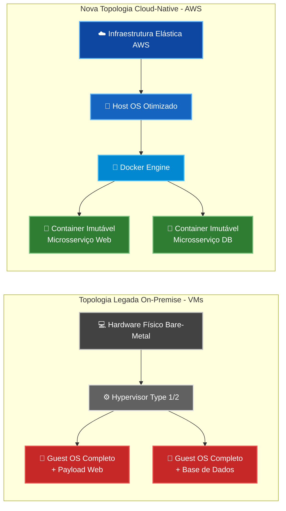
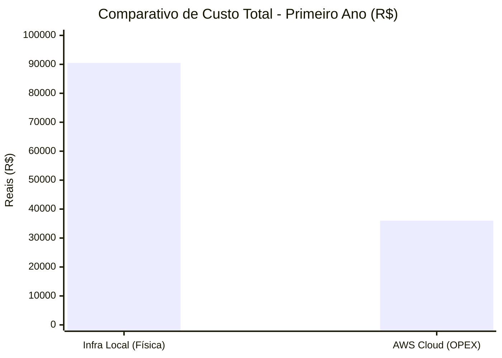
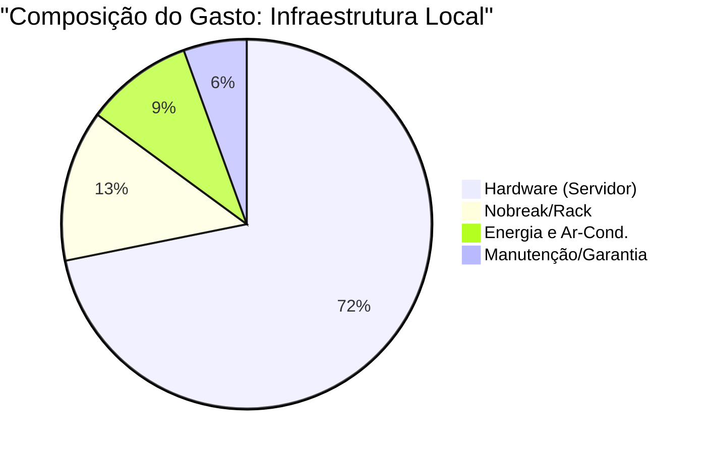

https://github.com/user-attachments/assets/b5573bdc-84da-4321-9439-995d42826972

# 📄 Relatório Técnico de Engenharia e Modernização de Sistemas
> **Projeto:** Modernização da Infraestrutura Tecnológica – Case DevStore  
> **Status:** Parecer Técnico Final (Versão Estendida & Arquitetura Detalhada)  
> **Responsável:** [Seu Nome/Grupo] – Arquiteto de Soluções & Engenheiro DevOps  

---

## 📌 1. Resumo Executivo
Este documento detalha o plano de transição da infraestrutura de TI da **DevStore** de um modelo de virtualização local legada para uma arquitetura moderna baseada em computação em nuvem (AWS) e conteinerização (Docker). O objetivo primordial é mitigar a dívida técnica acumulada, reduzir o TCO (Custo Total de Propriedade) e garantir uma escalabilidade elástica capaz de suportar o crescimento exponencial da startup com alta disponibilidade (SLA de 99,99%).

---

## 🔍 2. Diagnóstico da Situação Atual (Cenário *As-Is*)
A auditoria identificou que a DevStore opera sob uma topologia *On-Premise* ineficiente:
* **Déficit de Hardware:** Servidores físicos (*Bare-metal*) com manutenção dispendiosa e sem redundância geográfica.
* **Gargalo de Performance:** Uso de Máquinas Virtuais (VMs) tradicionais que geram um *overhead* excessivo ao exigir um Sistema Operacional completo para cada micro-serviço.
* **Fragmentação de Ambientes:** Falta de paridade entre o desenvolvimento e a produção, causando falhas críticas durante deploys.
* **Risco Operacional:** Ausência de monitoramento preditivo e segurança de rede perimetral automatizada.

---

## 🛠️ 3. Proposta de Nova Arquitetura (Cenário *To-Be*)
A estratégia recomendada é a adoção de uma arquitetura **Cloud-Native**, fundamentada em pilares de imutabilidade e elasticidade. A transição move a DevStore de um gerenciamento focado em hardware para um modelo de "Infraestrutura como Código" (IaC).

---

## 🗺️ 4. Diagrama Estrutural da Nova Infraestrutura
*O fluxograma abaixo compara o modelo monolítico virtualizado (Legado) com a arquitetura em nuvem conteinerizada (Proposta).*

---

## 🏛️ 5. Arquitetura de Sistemas: Análise Profunda de Componentes

Nesta seção, dissecamos o papel fundamental de cada camada computacional, contrastando as limitações do modelo legado com o ganho estratégico da nova arquitetura.

### 5.1. Arquitetura Legada: Virtualização Baseada em Hardware
*A topologia atual amarra a DevStore a limitações físicas e operacionais severas.*

* 💻 **Hardware Físico (*Bare-Metal*):** * **O que faz:** É o servidor físico real (CPU, RAM, Discos) residente no escritório da DevStore.
  * **Importância & Impacto:** É a fundação do processamento, mas no modelo local, atua como um teto rígido. A escalabilidade exige compra e instalação manual (*downtime*). Mais criticamente, a falha de uma fonte de energia ou placa-mãe representa um Ponto Único de Falha (SPOF), podendo paralisar a empresa inteira.
* ⚙️ **Hypervisor (Monitor de Máquina Virtual):** * **O que faz:** Software (ex: VMware, Hyper-V) que intercepta as chamadas de hardware e "engana" os sistemas operacionais convidados, fazendo-os acreditar que possuem um computador físico exclusivo.
  * **Importância & Impacto:** Foi revolucionário nos anos 2000 por permitir consolidação de servidores, mas hoje cobra o "imposto do hypervisor". Ele consome ciclos de CPU apenas para traduzir comandos virtuais para físicos, gerando latência em aplicações web de alta demanda.
* 🧱 **Sistema Operacional Convidado (*Guest OS*):** * **O que faz:** Um Windows ou Ubuntu completo instalado dentro de cada Máquina Virtual para hospedar uma única aplicação.
  * **Importância & Impacto:** É o maior dreno de recursos e segurança da empresa. Se a DevStore tiver 20 serviços rodando, ela gerencia 20 Sistemas Operacionais. Isso significa dezenas de gigabytes de RAM desperdiçados em processos em *background* e, do ponto de vista de segurança, multiplica a "superfície de ataque". A equipe de TI perde horas aplicando patches de segurança em cada VM separadamente.

### 5.2. Arquitetura Proposta: Nuvem e Containerização (Cloud-Native)
*A nova arquitetura elimina o overhead emulatório, adotando o conceito de efemeridade e abstração total de hardware.*

* ☁️ **Infraestrutura Cloud (AWS):** * **O que faz:** Provisão de recursos computacionais distribuídos pela internet (IaaS). O hardware passa a ser responsabilidade da Amazon, gerenciado pela DevStore via painel ou API.
  * **Importância & Impacto:** Transforma CAPEX (compra de servidores) em OPEX (mensalidade sob demanda). Traz a vital capacidade de **Multi-AZ (Zonas de Disponibilidade Múltiplas)**. Se um data center da AWS falhar devido a um desastre natural, a aplicação da DevStore é roteada automaticamente para outro data center a quilômetros de distância, sem queda de serviço.
* 🐧 **Sistema Operacional Hospedeiro (*Host OS*):** * **O que faz:** Um Linux ultra-minimalista (como Amazon Linux 2023 ou Bottlerocket) instanciado na nuvem, cuja única função é rodar o motor de containers.
  * **Importância & Impacto:** Reduz drasticamente a superfície de ataque. Por não possuir interfaces gráficas ou ferramentas desnecessárias, é altamente imune a malwares tradicionais e deixa quase 100% da RAM livre para as aplicações reais da empresa.
* 🐳 **Docker Engine (Motor de Containerização):** * **O que faz:** Em vez de virtualizar hardware como o Hypervisor, o Docker virtualiza o *Sistema Operacional*. Ele utiliza os recursos do kernel do Linux — especificamente *Namespaces* (para garantir que um container não enxergue o outro) e *Cgroups* (para limitar o máximo de CPU e RAM que um container pode usar).
  * **Importância & Impacto:** É o coração da padronização. Ele abstrai toda a infraestrutura subjacente. Para o desenvolvedor da DevStore, não importa se o código vai rodar no seu notebook, em um servidor na Europa ou nos EUA; o Docker garante o mesmo ambiente de execução.
* 🚀 **Containers Leves (Aplicações Imutáveis):** * **O que faz:** Pacotes contendo *apenas* o código compilado da DevStore, a linguagem (ex: Node.js/Python) e as bibliotecas essenciais. Não possuem sistema operacional embutido.
  * **Importância & Impacto:** Adotam a filosofia de *"Cattle, not Pets"* (Gado, não Animais de Estimação). Se um container trava, não perdemos tempo "consertando" ou reiniciando como faríamos com um servidor. O orquestrador simplesmente o destrói e cria um clone idêntico em milissegundos. Isso zera a inconsistência de ambientes e permite a integração perfeita com pipelines CI/CD automatizados.

---

## 📈 6. Análise de TCO (Custo Total de Propriedade) e Viabilidade Econômica

Manter datacenters locais exige investimento em **CAPEX** (ativos que depreciam rapidamente). A migração para a AWS (IaaS) transforma a infraestrutura de TI em **OPEX** (despesa sob demanda).

### Estudo de Viabilidade (Simulação High-End 1º Ano)

| Categoria de Despesa | Cenário On-Premise (CAPEX) | Cenário Cloud AWS (OPEX Elastic) |
| :--- | :--- | :--- |
| **Ativos Físicos (Servidores, RAM ECC, NVMe)** | R$ 65.000,00 | R$ 0,00 |
| **Facilities (Rack, Nobreak de Dupla Conversão)**| R$ 12.000,00 | R$ 0,00 |
| **Operação Crítica (Energia e HVAC 24/7)** | ~ R$ 8.500,00 / ano | R$ 0,00 (Terceirizado) |
| **Depreciação e Contratos de Garantia (SLA)**| ~ R$ 5.000,00 / ano | R$ 0,00 |
| **Consumo Computacional (Instâncias EC2, RDS, Bandwidth)** | R$ 0,00 | ~ R$ 36.000,00 / ano* |
| **TCO Estimado (Ano 1)** | **R$ 90.500,00** | **R$ 36.000,00** |

> ***Nota do Arquiteto:** A abordagem em nuvem resulta em um **Saving de 60% no primeiro ano**. Mais criticamente, garante que a DevStore pague apenas pelo tráfego que consome (Elasticidade), protegendo o fluxo de caixa da startup.*

#### Gráficos de Apoio Financeiro

---

## 🛡️ 7. Governança, Segurança e Observabilidade (DevSecOps)

Uma infraestrutura corporativa não se sustenta apenas com código. A transição para a AWS incluirá as seguintes práticas rigorosas:

* **Identity and Access Management (IAM):** Fim do acesso root compartilhado. Implementação de Princípio do Menor Privilégio (PoLP) para a equipe de devs.
* **Segurança de Perímetro:** Fechamento de portas públicas diretas aos servidores, utilizando instâncias em sub-redes privadas (VPC) protegidas por *Security Groups* e *Load Balancers* públicos.
* **Observabilidade Contínua:** Implantação do stack Prometheus + Grafana para coleta de métricas de uso (CPU/RAM dos containers) e monitoramento de saturação preditivo.

---

## 📊 8. Síntese Técnica Comparativa

| Atributo | Máquinas Virtuais (VMs) | Containers (Docker) |
| :--- | :--- | :--- |
| **Nível de Abstração** | Hardware (Hypervisor) | Sistema Operacional (Kernel) |
| **Tempo de Boot** | Minutos (Boot completo da VM) | Milissegundos (Start do processo) |
| **Consumo de Memória** | Alto (OS Completo + App) | Baixo (Apenas Payload da App) |
| **Gestão de Configuração** | Mutável (Sujeita a desvios) | Imutável (Definida no Dockerfile) |
| **Portabilidade** | Restrita ao formato do Hypervisor | Universal (Cross-Platform) |

---

## 🚀 9. Conclusão e Roadmap de Implementação

A manutenção do ambiente legado representa um risco sistêmico à continuidade do negócio da DevStore. A adoção do ecossistema Linux + Docker + AWS transcende uma mera atualização de software; é uma refatoração completa da cultura de engenharia da empresa.

**Próximos Passos (Plano de Ação de 30 dias):**
1. Migração de artefatos de código para repositório centralizado (**Git/GitHub**).
2. Escrita dos `Dockerfiles` e testes de build local.
3. Provisionamento da infraestrutura base na AWS (VPC, Subnets, EC2/ECS).
4. Estabelecimento da pipeline CI/CD via GitHub Actions para *deploy* automatizado.

---
*Relatório de arquitetura fundamentado em padrões de mercado (Tanenbaum; AWS Well-Architected Framework; Cloud Native Computing Foundation - CNCF).*
